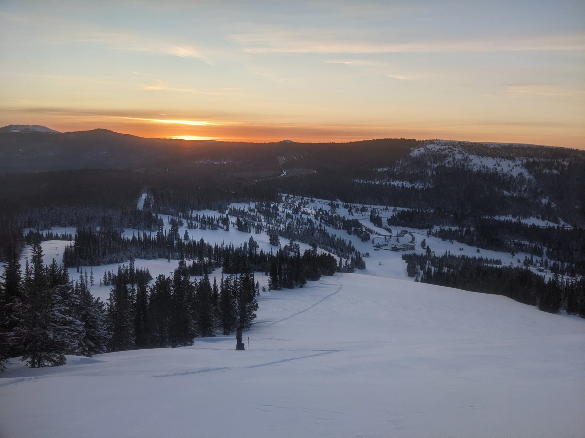

This is the knowledge vault for Group 3's AD470 Practicum at [North Seattle College.](https://northseattle.edu/programs/application-development/application-development-bachelor-applied-science-bas-degree) We are using meterological and topographical data collected from various sources to make projections on the likelihood of an [[notes/Avalanche|avalanche]] happening based on the given conditions.

# Concepts and Definitions
Here are links to helpful concepts for understanding snow science, avalanches, and the conditions that create them.
- [[notes/Avalanche|Avalanche]]
- [[notes/SNOTEL|SNOTEL]]

# 📊 CSV Datasets
Here are the pages for the various `.csv` datasets that we've compiled thus far.
- [[notes/datasets/Avalanche Danger Ratings for April 2023 by Zone|Avalanche Danger Ratings for April 2023 by Zone]]
- [[notes/datasets/Avalanche Danger Ratings for the Olympics|Avalanche Danger Ratings for the Olympics]]
- [[notes/datasets/Danger Ratings By Area from November 2022 through April 2023|Danger Ratings By Area from November 2022 through April 2023]]
- [[notes/datasets/Morse Lake Snotel Data for March 2023|Morse Lake Snotel Data for March 2023]]
- [[notes/datasets/Morse Lake Snotel Data for 4-17-23 through 4-24-23|Morse Lake Snotel Data for 4-17-23 through 4-24-23]]
- [[notes/datasets/Seasonal Morse Lake Snotel Data|Seasonal Morse Lake Snotel Data]]
- [[notes/datasets/Seasonal Weather Data for Crystal Summit|Seasonal Weather Data for Crystal Summit]]

# 💻 Project Links
Here are some compiled links for our external project resources.
- [Github Project Board](https://github.com/users/itsjpb/projects/2/views/1)
- [Github Repository](https://github.com/itsjpb/470-avalanche-prediction)

# 📚 Helpful Internal Links for Contributing
- [[notes/Markdown for Obsidian|Markdown for Obsidian]]

## Existing Capstone Project
We found the repo for [[notes/Drew Thayers Avalanche Prediction Capstone Project|Drew Thayers Avalanche Prediction Capstone Project]], which might be useful for seeing an existing example.
